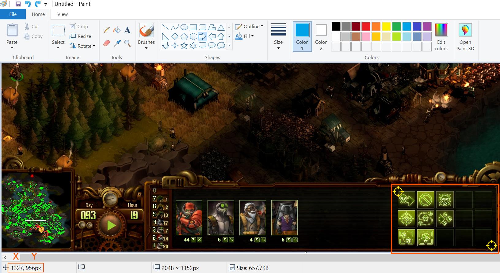

# They Are Billions: Early Hotkeys
## Version 0.9
AutoHotkey configuration for They Are Billions, the famously difficult zombie indie game.

Until Numantian Games comes out with their own hotkey system, here's a third-party one for They Are Billions! (I sympathize as a developer - I know it's not trivial, especially for a custom engine!)

I have been play testing this in my own games. There are still some quirks to work out (especially for less-used or late-game stuff), but I think it's playable enough to share!

This is an [AutoHotKey](https://autohotkey.com/) script. AutoHotKey is an powerful and popular open-source program to modify your controls. AutoHotKey version 1.1.05+ required.

# Setup
## Install autohotkey
[Download link](https://autohotkey.com/download/)

## Customize the script
You need to edit the script for your screen size. (Mine is a 2048x1152 monitor, so if that's what you use, you can keep the default values.)

1. Take a screenshot of They Are Billions
2. Open your screenshot in Microsoft Paint
3. Get the coordinates of the _top-left_ and _bottom-right_ pixels of the 5x3 grid of buttons (right on the edge of the clickable area). Mouse over them, then read the number in the lower left.
4. In ```they_are_billions.ahk```, set x_min and y_min to the top-left corner and x_max and y_max to the bottom-right corner



Yellow crosshairs mark the corner. Pixel coordinates of the mouse cursor are show in the marked box.

# Usage
With AutoHotKey installed, just double click on the .ahk file! Depending on your operating system, you might instead have to Run as Administrator. Right click on the .ahk file and select Run as Administrator.

(If you are leery of giving some software from the internet admin access, well, good for you! You should be leery! However, AutoHotKey has been out for a long time, is quite popular, and most importantly, is open-source. These combined mean that there has been plenty of time for people to judge the reliability and catch security issues while looking over the code.)

ESC no longer activates the in-game menu! It's still there, you just have to click the button. Or, you can Alt-Tab out of the game and...

## Disable the Script
Here's how to stop the hotkey script. E.g. to type in Steam chat, or use other programs on your computer.

1. Alt-Tab to windows and right click the green H icon.
2. Click _Exit_ to close the hotkey script or _Suspend Hotkeys_ to temporarily disable it

# Hotkey reference
[Hotkey reference guide](hotkey_reference.md).

All buildings are laid down with a sequence of three keys. They will be of the form B-X-Y, where:

- B is for Build
- X is the menu hotkey (matches in-game tooltip)
- Y is that building's hotkey. See the hotkey reference guide.

ESC returns to the previous menu, the command center menu. (I wanted it to also function as "cancel", but that's trickier to implement.) B brings up the command center menu.

Thus, if the hotkeys are doing something funny, you can hit ESC or B, whichever feels more natural and the hotkeys will do what you expect them to again! (I use both: Esc feels natural to me as a single press, when I've selected units; B feels natural to me when building, as part of a B-X-Y triplet.)

## Relation to Starcraft
Hotkeys are heavily inspired by Starcraft 1 and 2. This means that:

1) B for build (selects the command center)
2) Hotkeys come from the name of the building
3) Keys on the left-hand are preferred; thus letters can come from the middle of a word
4) They sometimes use the Starcraft building name - e.g. B (Barracks) for Soldier Center

If, after reading that explanation, some of hotkeys seem strange to you, know that some of my choices are based on the limitations of the hacky method I used to create a context-sensitive hotkey system in a couple evenings.

# Limitations
The big thing you should be aware of is that this script has ZERO access to They Are Billions. All it knows are the keys you press. I'm doing the best I can! I ironed out all-the game-breaking issues and we're left with these. Until I can fix them, here are some workarounds.

Sometimes you can get in a weird state where this script thinks you're in a different menu and thus doesn't do what you expect it to. _If the hotkeys are acting up, hit ESC omce!_ This will tell the script you're back at the command center menu.

You will see your cursor move. This is a side-effect of the clicking method I used to implement the hotkeys. Sometimes - e.g. final horde lag, your [APM](https://en.wikipedia.org/wiki/Actions_per_minute) is too fast ;-) - the cursor won't make it all the way to the button before the mouse clicks. I could increase the delay to prevent this, but I'd rather have a fast UI. (That's why I made these hotkeys in the first place!) _If the cursor misses, either a) hit the final button in the sequence again or b) hit ESC and redo the sequence._

This script doesn't know about control groups! So if you exit a build menu by hitting, e.g. "1" to select your archers on control group one, the script will still think you're in a building menu and attack move will do something weird. _When selecting units after building, hit ESC once._ Finding a way to deal with this is my first priority right now.

# License
GPLv3+ for everybody except Numantian Games, who can do WTF they want with this code! <3

# Roadmap
Planned features for the next few releases - feel free to comment!

## 1.1
- Grid layout. I planned this with a lower priority, requested by [u/indiez](https://www.reddit.com/r/TheyAreBillions/comments/7ntzlw/i_added_hotkeys_to_the_game/ds4qdtn/)
- Easier setup: script will figure out button pixel coordinates from your resolution. Hopefully this will be easy (scale factor). Otherwise, I'll have to go through each resolution and make a giant list for each case. (Send me your resolution and corner coordinates please!)

## 1.0
- When switching to units or buildings via control group, menu will switch to whatever you have told AutoHotKey you use that hotkey for. (E.g. I use 1 for my main army, 2 for my fast arm, and 5 for my soldier's center)
- Will only change hotkeys for They Are Billions. Thus, you can Alt-Tab without any trickiness

# Change Log
## Note on version numbering
I figure this is going to be a short-lived project. Eventually (maybe they'll put it off now!) Numantian Games will finish adding hotkeys to They Are Billions. I estimate a few months to a year. And this is a small project with few features. So, two version numbers is plenty.

## 0.95
- Almost all the building hotkeyed
- Esc now deselects a building that's attached to the cursor. Feels better when used to cancel a building that's selected but not placed.

## 0.9
Initial. I started at this number because I feel the build is playable but with a couple game-breaking quirks that are tricky to get out of.
